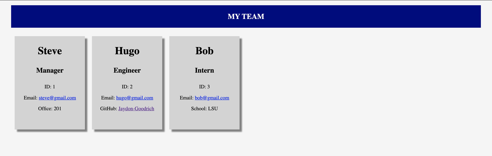

# team-profile-generator

## Description

A team profile generator application. This application uses inquirer to prompt the user for a series of questions about a manager, engineer, and interns that are on the team. Once the information is received the user is presented with an html file displaying all the users on it.

## Table of Contents

* [Installation](#installation)
* [Usage](#usage)
* [Credits](#credits)
* [License](#license)

## Installation

* Clone the team-profile-generator code from GitHub
* Make sure nodeJS is installed on your computer
* Open the file and run npm install to make sure all the dependencies are installed
* make sure you are on the same level as index.js and run node Index.js

## Usage 

* make sure you are on the same level as index.js and run node Index.js
* Answer the series of questions
* Open the html file that was created in the dist folder to view your newly generated file

## Contributing

All the code for this project was written by Jaydon Goodrich

## Tests

npm run test

## License

Code released under the [Unlicense](http://unlicense.org/)

****

## Questions
For further questions I can be reached at:

GitHub: [Jaydon-Goodrich](https://github.com/Jaydon-Goodrich)

Email: JaydonGoodrich@gmail.com

Further Instructions: 

You can also reach out on the following social media platforms:

Instagram: Jaydon-Goodrich

Facebook: Jaydon-Goodrich

LinkedIn: Jaydon-Goodrich
    
## Reference

[Link to Youtube showing this project](https://youtu.be/_kXlnGy6O9I)

